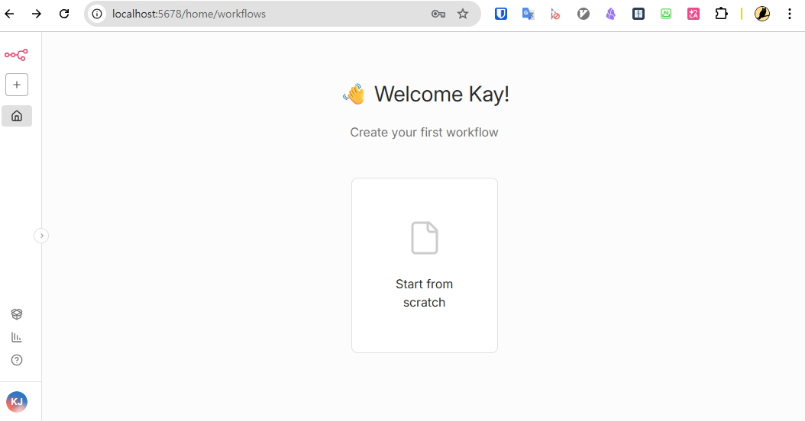

## 개요
사내 강좌를 통해 인프런의 [코딩 없이 AI 자동화 전문가가 되는 법, n8n 완벽 가이드](https://biz.inflearn.com/course/ai-%EC%9E%90%EB%8F%99%ED%99%94-n8n/dashboard?cid=337053) 강좌 수업에 대한 요약을 정리
- 일정: 2026년 4월
- 구분: n8n
- 강사: 남박사
- n8n site: https://n8n.io/

## 섹션1. AI Agent N8n
### 1. AI Agent에 대한 이해와 각종 Tool에 대해 알아보기
- AI Agent
  - '생각'과 '판단'이 가능한 자동화 프로그램
  - 인간이 생각하는 모든 영역을 가능하게 함
- AI Agent 만드는 방법
  - 직접 코딩
  - 노코드 툴 활용: n8n, make, zapier 등
- n8n 선택 이유
  - 셀프 호스팅 가능
  - API 자유 압도적이며, 큰 강점
  - 단점: 사용자 직접 설치 및 서버 운용 필요

### 2. 완전 초보를 위한 N8N 설치부터 셀프호스팅까지 - Docker 실습편
#### 설치 전 준비
- 필요 프로그램: Git for Windows, Docker Desktop
- Git 설치
  - https://git-scm.com/ 에서 다운로드 받아 설치 진행
  - 특별한 설정 변경 필요 없음
- Docker Desktop
  - 설치 전 Windows 기능 켜기/끄기에서 Hyper-V, WSL, 하이퍼바이저 플랫폼 활성화 필요(재부팅)
  - [공식 설치 문서](https://docs.docker.com/desktop/setup/install/windows-install/) 참고
  - 설치 위치: `C:\Program Files\Docker\Docker`
#### 설치
- n8n 설치는 [Starter Kit](https://docs.n8n.io/hosting/starter-kits/ai-starter-kit/)으로 진행
  - n8n, Ollama, Qdrant, PostgreSQL 세트
- Starter Kit git clone
```cli
PS D:\_tinyLab\n8n-master> git clone https://github.com/n8n-io/self-hosted-ai-starter-kit.git
Cloning into 'self-hosted-ai-starter-kit'...
remote: Enumerating objects: 160, done.
remote: Counting objects: 100% (2/2), done.
remote: Compressing objects: 100% (2/2), done.
remote: Total 160 (delta 0), reused 0 (delta 0), pack-reused 158 (from 2)
Receiving objects: 100% (160/160), 3.92 MiB | 18.69 MiB/s, done.
Resolving deltas: 100% (71/71), done.
```
!! 주의: 현재 시점 n8n은 2.x로 버전업이 되었으나, 학습 강의는 1.x로 되어 있어서 docker-compose.yml을 강좌에서 제공하는 별도의 파일로 교체 해줘야 한다.
- 설치 HW의 GPU 여부에 따라 별도 명령어로 docker compose 실행한다.
- cpu only : `docker compose --profile cpu up` [Starter Kit](https://docs.n8n.io/hosting/starter-kits/ai-starter-kit/)의 설치 소개 참고
#### 문제 해결
- 버전 등의 문제로 Starter Kit을 다시 설치해야 할 경우
  - `docker-compose.yml` 파일을 열어 버전 수정
  - 컨테이너 제거: `docker compose down`
  - 이미지 다시 Pull 및 다시 실행: `docker compose pull && docker compose --profile cpu up -d`

## 섹션2. 채팅 AI Agent 만들기
### 3. N8N 기본 인터페이스와 채팅 AI Agent 생성해보기
#### n8n 접속 및 기본 사용법
- 접속: 웹 브라우저통해 http://localhost:5678 접속
  - 기본 아이디, 패스워드 입력하여 계정 생성
  - 로그인 후 첫 화면


#### 문제 해결
- chat message 에서 메세지 발송 시 오류가 날 경우
  - docker-compose.yml 파일에 `N8N_PUSH_BACKEND=websocket` 항목 추가 후 재 실행 `docker compose up -d --force-recreate`


## 섹션3. 이메일 AI Agent
