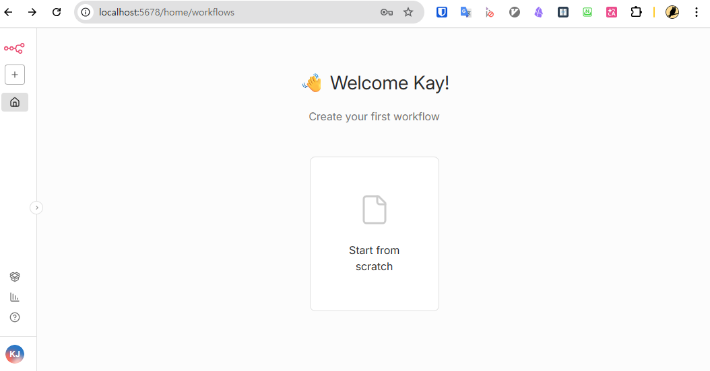

## 개요
사내 강좌를 통해 인프런의 [코딩 없이 AI 자동화 전문가가 되는 법, n8n 완벽 가이드](https://biz.inflearn.com/course/ai-%EC%9E%90%EB%8F%99%ED%99%94-n8n/dashboard?cid=337053) 강좌 수업에 대한 요약을 정리
- 일정: 2026년 4월
- 구분: n8n
- 강사: 남박사
- n8n site: https://n8n.io/
- n8n 이름의 의미
  - Node(노드) + Automation(자동화) = nodemation → n8n

## 섹션1. AI Agent N8n
### 1. AI Agent에 대한 이해와 각종 Tool에 대해 알아보기
- AI Agent
  - '생각'과 '판단'이 가능한 자동화 프로그램
  - 인간이 생각하는 모든 영역을 가능하게 함
- AI Agent 만드는 방법
  - 직접 코딩
  - 노코드 툴 활용: n8n, make, zapier 등
- n8n 선택 이유
  - 셀프 호스팅 가능
  - API 자유 압도적이며, 큰 강점
  - 단점: 사용자 직접 설치 및 서버 운용 필요

### 2. 완전 초보를 위한 N8N 설치부터 셀프호스팅까지 - Docker 실습편
#### 설치 전 준비
- 필요 프로그램: Git for Windows, Docker Desktop
- Git 설치
  - https://git-scm.com/ 에서 다운로드 받아 설치 진행
  - 특별한 설정 변경 필요 없음
- Docker Desktop
  - 설치 전 Windows 기능 켜기/끄기에서 Hyper-V, WSL, 하이퍼바이저 플랫폼 활성화 필요(재부팅)
  - [공식 설치 문서](https://docs.docker.com/desktop/setup/install/windows-install/) 참고
  - 설치 위치: `C:\Program Files\Docker\Docker`
#### 설치
- n8n 설치는 [Starter Kit](https://docs.n8n.io/hosting/starter-kits/ai-starter-kit/)으로 진행
  - n8n, Ollama, Qdrant, PostgreSQL 세트
- Starter Kit git clone
```cli
PS > git clone https://github.com/n8n-io/self-hosted-ai-starter-kit.git
Cloning into 'self-hosted-ai-starter-kit'...
remote: Enumerating objects: 160, done.
remote: Counting objects: 100% (2/2), done.
remote: Compressing objects: 100% (2/2), done.
remote: Total 160 (delta 0), reused 0 (delta 0), pack-reused 158 (from 2)
Receiving objects: 100% (160/160), 3.92 MiB | 18.69 MiB/s, done.
Resolving deltas: 100% (71/71), done.
```
!! 주의: 현재 시점 n8n은 2.x로 버전업이 되었으나, 학습 강의는 1.x로 되어 있어서 docker-compose.yml을 강좌에서 제공하는 별도의 파일로 교체 해줘야 한다.
- 설치 HW의 GPU 여부에 따라 별도 명령어로 docker compose 실행한다.
- cpu only : `docker compose --profile cpu up` [Starter Kit](https://docs.n8n.io/hosting/starter-kits/ai-starter-kit/)의 설치 소개 참고
#### 문제 해결
- 버전 등의 문제로 Starter Kit을 다시 설치해야 할 경우
  - `docker-compose.yml` 파일을 열어 버전 수정
  - 컨테이너 제거: `docker compose down`
  - 이미지 다시 Pull 및 다시 실행: `docker compose pull && docker compose --profile cpu up -d`

## 섹션2. 채팅 AI Agent 만들기
### 3. N8N 기본 인터페이스와 채팅 AI Agent 생성해보기
#### n8n 접속 및 기본 사용법
- 접속: 웹 브라우저통해 http://localhost:5678 접속
  - 기본 아이디, 패스워드 입력하여 계정 생성
  - 로그인 후 첫 화면


#### 문제 해결
- chat message 에서 메세지 발송 시 오류가 날 경우
  - docker-compose.yml 파일에 `N8N_PUSH_BACKEND=websocket` 항목 추가 후 재 실행 `docker compose up -d --force-recreate`

#### chat agent 구성 및 OpenAI API 키 설정
- On Chat message → AI Agent 구성으로 간단한 AI Agent 생성
- OpenAI API
  - [OpenAI 개발자 페이지](https://platform.openai.com/)에서 API 키 생성 및 등록
  - 생성된 키는 재확인 불가

### 4. 채팅Agent에 메모리 노드와 SerpAPI툴을 사용해 검색 능력 부여하기
#### 메모리
- 심플 메모리를 통해 이전 대화 저장
- Context window 길이를 많이 잡을 수록 기억하는 내용이 많아지지만, 그만큼 토큰을 많이 사용
- 5~10 정도로 설정
#### SerpAPi (검색)
- Google Search API
- 회웍가입 후 이메일, 휴대폰 인증
- free plan의 경우 월 250 검색 사용 가능
#### 문제 해결
n8n 버그로 SerpAPI 오류
- SerpAPI Official 사용
  - 툴 추가 검색에서는 하나만 검색되나, 전체 검색을 통해 Official을 install 할 수 있다
  - 설치 후 검색을 통해 사용 가능
- 이전 노드의 json사용
  - https://www.inflearn.com/community/questions/1705920 에서 확인 가능
- 검색 해보니 SerpAPI 보다는 Official 사용을 권장

### 5. AI Agent에 직접 Google API 를 사용해서 구글 검색 툴 작성하기
#### Google Gemini API 발급
- 이 강좌에서는 두개의 Google API 사용(Gemini API, Custom Search API)
- 이 중 **Custom Search API는 2026-1-21 공지를 통해 단계적으로 종료예정으로 신규 고객에게 제공하지 않으며, 기존 고객도 2027년 1월까지 제거될 예정**이라 함
- **이에 따라 Google Search API는 사용할 수 없음** → 대안으로 Brave Search 사용
- 강좌에서는 Google Cloud Console에서 발급을 받았으나, Google AI Studio에서 발급 받아 사용할 수도 있음(훨씬 단순함)
#### Brave Search 사용
- Brave Search API 발급
  - https://brave.com/search/api/ 에 로그인(사용자 등록 후)하여 API 발급 가능
  - 2,000/월 무료 사용 가능(1초당 1요청 제한) 

### 6. 네이버 검색 API 를 추가하고 검색 기능을 서브 워크플로우로 작성하기
#### 네이버 검색 API 생성
- [네이버 개발자 센터](https://developers.naver.com/) 회원가입/로그인
- `메뉴>Application>내 애플리케이션` 에서 새 Application등록
  - 이름: n8n-search
  - 사용API: 검색
- 인증방식은 client id 와 client sercret을 http header로 전달
#### n8n에서 http quest 노드로 구성
- 헤더에 X-Naver-Client-Id, X-Naver-Client-Secret 추가
#### 워크플로우 재사용
- 구성된 워크플로우를 다른 워크플로우에서 호출 가능
#### 복수 검색 결과 머지 및 출력 가능
- 네이버, 구글 등의 검색 결과를 각각 수집하여 통합하여 사용
- merge , aggregate 노드 사용
#### 워크플로우 결합 시 테스트 방법
- 호출되는 워크플로우에 Manual Trigger, set 노드 추가해서 테스트 가능
- AI Agent 호출 없이 변수(query)설정 후 단독 테스트 가능

## 섹션3. 이메일 AI Agent

### 7. AI로 네이버 스팸 메일 자동 분류하기: 이메일 에이전트 완전 자동화 실습
#### 이메일 자동 수신 설정
- 트리거노드: Email Trigger (IMAP) 사용
- 메일(Naver, Google 등) 설정 방법
  - 네이버 메일 환경설정 진입 → IMAP/SMTP 사용
  - 2단계 인증 설정된 경우 애플리케이션 비밀번호 생성 필요함
  - 화면의 호스트, 포트 정보 확인하여 기입
#### 자동 수신 메일 AI분석
- 이메일 도착하면 AI워크플로 시작
- Subject, text 를 AI프롬프트 입력하여 Spam여부 판단
- Structured Output Parser 이용해 yes, no 처리
#### 스팸여부 결과에 따른 분기 처리
- Switch노드 이용하여 분기 처리
- 이메일의 uid를 가져오기 위해 n8n 커뮤니티 노드 설치
- 커뮤니티노드 검색 통해 imap 노드 인스톨
- 추가 기능 설치로 스팸메일의 휴지통폴더로 이동 처리 

### 8. Gmail연동부터 자동 응답까지: 이메일AI에이전트 완전 구축법
#### Gmail 이메일 연동 및 노드 추가
- 기존 이메일 트리거 복제 후 Gmail용으로 설정
- imap.gmail.com 호스트 입력
- 앱비밀번호 설정 후 입력
  - 계정 설정 후 다른 계정들처럼 바로 성공되지 않음. 테스트 시 메일 내용 정상 수신 확인
#### 디버깅 방법
- 이메일의 경우 백그라운드 실행 됨
- Executions 탭에서 실행 기록 확인해서 디버깅 진행
#### 다양한 메일 구조 통합 처리 방법
- Edit Fields 노드 이용해 분기 및 통합 처리
- Edit Fields 노드 3개를 이용해서 각 메일의 구조 각각 통합 후 하나로 통합 처리
#### 메일 내용 한글 깨짐 문제 처리
- Gmail 텍스트 깨질 경우 Resolved로 변경
- AI에게 그대로 전달하고 디코딩 요청하면 된다
#### 오류 처리
- Switch 또는 조건 비교에서 특정 노드의 데이터를 참조할 때 item 접근이 불가능한 경우 발생
  - 해결법: first() 함수 사용
  - 예: {{$node["메일 데이터"].first().json["from"]}}

### 9. 메일 한 통이면 끝! 구글 캘린더와 연동된 미팅 자동화 에이전트 만들기
#### 이메일 기반 미팅 에이전트 시나리오 구상
- 목표: 메일로 일정 문의가 오면 → 일정 확인 → 미팅 가능 시 자동 회신
- 동작 흐름 구상 및 시나리오 작성의 중요성 강조
- "프롬프트는 곧 시나리오 설계이다"라는 인식 필요
#### 구글 캘린더 API 연동을 위한 OAuth 인증 구성
- Google Cloud Console에서 OAuth Client 생성
- 승인된 리디렉션 URI에 n8n의 파이툴 리디렉션 주소 등록
- 테스트 유저 등록 및 테스트 모드에서 인증 절차 완료
#### n8n에서 구글 캘린더 툴 구성
- 일정 확인용 노드 (`CAL-Read`)
  - `Get Many` 설정, `Time After`, `Time Before`는 AI가 설정
- 일정 등록용 노드 (`CAL-Write`)
  - `Create` 설정, 시작/종료 시간 역시 AI가 자동 설정
#### 프롬프트 설계 전략
- 역할 부여: “당신은 메일 회신 전문 에이전트입니다.”
- 조건 명시:
  - CAL-Read → 일정 확인
  - CAL-Write → 일정 등록 (가능할 때만)
  - 받은 메일 제목 앞에 "Re:" 붙여 회신
- 예시 문장 포함: “5월 10일 오후 3시에 뵙겠습니다.” 등
#### AI가 오늘 날짜를 정확히 인식하게 하는 방법
- `Date & Time` 노드 사용하여 현재 날짜 가져오기
- 타임존을 `Asia/Seoul`로 설정해 정확한 시간 반영
- 중간 노드로 연결하고, 프롬프트 작성 시 현재 날짜 전달
#### 메일 자동 회신 처리 테스트
- 네이버 메일을 사용하여 일정 문의 메일 발송
- 테스트를 위한 데이터 고정(Pin 기능 활용)
- AI가 캘린더 일정 확인 후, 가능한 경우 회신 메일 자동 작성 및 발송
#### 한계 및 다음 강좌 예고
- 모든 메일이 미팅 요청은 아님 → 필터링 필요
- 발신자가 신뢰할 수 있는 인물인지 판단 필요
- 다음 시간에는 **구글 주소록**을 연동하여 주소록에 등록된 인물에게만 미팅 일정을 잡는 기능을 구현할 예정

### 10. 주소록 기반 자동 미팅 응답 시스템 만들기: 구글 API와 AI 에이전트의 결합

#### 미팅 이메일 에이전트 개선 배경
- 기존 문제점: 누구에게서 오든 미팅 관련 내용이 있으면 무조건 회신함
- 개선 방향: 구글 주소록에 등록된 사람에게만 회신하도록 조건 추가
#### Google People API 연동
- 클라우드 콘솔에서 Google People API 활성화
- 기존 OAuth 클라이언트 ID와 Secret 재사용
- `Google Contacts Tool` 노드 설치 및 인증
- Operation을 `Get Many`로 설정하여 전체 주소록 검색
#### AI 프롬프트 수정
- AI에게 명확한 판단 기준 제시
  - 이메일 수신 시 연락처 검색 필수
  - 검색은 이메일 주소만 활용
  - 주소록에 없으면 회신하지 않음
- is_reply 필드 추가 → 회신 여부에 따라 분기 처리 가능
#### 조건 분기 및 동작 흐름 구성
- `Switch` 노드를 사용하여 회신 여부에 따라:
  - `true`: 회신 이메일 및 구글 캘린더 일정 등록
  - `false`: 아무 동작도 하지 않음 (또는 알림 처리 가능)
#### 구글 캘린더 일정 등록 상세화
- 기존에는 제목·내용 미기입 → `additional fields`에 `summary`, `description` 추가
- AI가 일정 제목 및 설명 자동 생성 → **더 자연스러운 일정 생성 가능**
#### 활용 및 확장 아이디어
- 주소록에 ‘호칭’ 정보까지 활용 가능 (메일 내 인삿말 자동화)
- 향후 업무 전용 이메일 에이전트로 확장 가능성
  - 예: 이전 메일·첨부파일·슬랙 대화 등 DB화하여 맥락 이해 후 응답
  - Slack/Telegram/Discord 등 다양한 입력 채널도 통합 가능
####  실전 팁 & 기술 포인트
- Google Contacts Tool 연동 시 주의점
  - 반드시 Google People API 사용해야 주소록 접근 가능
  - 쿼리는 AI에게 맡기되, 조건(이메일 주소만 사용)은 프롬프트에 명확히 설정
- 이메일 회신 조건 분기 처리
  - Switch 노드로 is_reply: true/false 조건에 따라 후속 노드 연결
- 일정 정보 세분화
  - 캘린더 등록 시 summary, description 등 개별 필드 AI에 위임 가능
- 메일 발신자 정보 활용
  - 주소록에 등록된 이름 기준으로 호칭 자동 적용 → 자연스러운 메일 응답
  
  